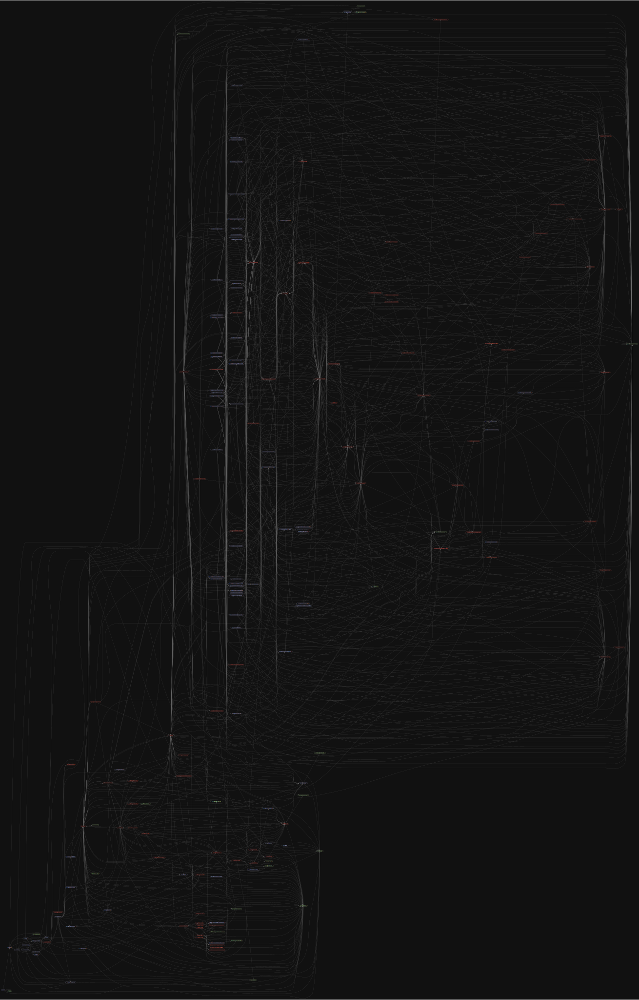

# 源码分析

## 文件结构

``` bash
/Users/liufang/openSource/FunnyLiu/rollup
├── CHANGELOG.md
├── CODE_OF_CONDUCT.md
├── CONTRIBUTING.md
├── LICENSE-CORE.md
├── LICENSE.md
├── README.md
├── browser
|  ├── crypto.ts
|  ├── fs.ts
|  └── path.ts
├── cli
|  ├── help.md
|  ├── index.ts
|  ├── logging.ts
|  ├── run
|  |  ├── batchWarnings.ts
|  |  ├── build.ts
|  |  ├── index.ts
|  |  ├── loadConfigFile.ts
|  |  ├── resetScreen.ts
|  |  ├── timings.ts
|  |  └── watch.ts
|  └── sourceMappingUrl.ts
├── docs
|  ├── 00-introduction.md
|  ├── 01-command-line-reference.md
|  ├── 02-javascript-api.md
|  ├── 03-es-module-syntax.md
|  ├── 04-tutorial.md
|  ├── 05-plugin-development.md
|  ├── 06-faqs.md
|  ├── 07-tools.md
|  ├── 08-troubleshooting.md
|  └── 999-big-list-of-options.md
├── markdownlint.json
├── package-lock.json
├── package.json
├── rollup.config.js
├── scripts
|  ├── load-perf-config.js
|  ├── perf-debug.js
|  ├── perf-init.js
|  ├── perf.js
|  └── test-package.js
├── src
|  ├── Chunk.ts
|  ├── ExternalModule.ts
|  ├── Graph.ts
|  ├── Module.ts
|  ├── ModuleLoader.ts
|  ├── ast
|  |  ├── CallOptions.ts
|  |  ├── DeoptimizableEntity.ts
|  |  ├── Entity.ts
|  |  ├── ExecutionContext.ts
|  |  ├── keys.ts
|  |  ├── nodes
|  |  |  ├── ArrayExpression.ts
|  |  |  ├── ArrayPattern.ts
|  |  |  ├── ArrowFunctionExpression.ts
|  |  |  ├── AssignmentExpression.ts
|  |  |  ├── AssignmentPattern.ts
|  |  |  ├── AwaitExpression.ts
|  |  |  ├── BinaryExpression.ts
|  |  |  ├── BlockStatement.ts
|  |  |  ├── BreakStatement.ts
|  |  |  ├── CallExpression.ts
|  |  |  ├── CatchClause.ts
|  |  |  ├── ClassBody.ts
|  |  |  ├── ClassDeclaration.ts
|  |  |  ├── ClassExpression.ts
|  |  |  ├── ConditionalExpression.ts
|  |  |  ├── ContinueStatement.ts
|  |  |  ├── DoWhileStatement.ts
|  |  |  ├── EmptyStatement.ts
|  |  |  ├── ExportAllDeclaration.ts
|  |  |  ├── ExportDefaultDeclaration.ts
|  |  |  ├── ExportNamedDeclaration.ts
|  |  |  ├── ExportNamespaceSpecifier.ts
|  |  |  ├── ExportSpecifier.ts
|  |  |  ├── ExpressionStatement.ts
|  |  |  ├── ForInStatement.ts
|  |  |  ├── ForOfStatement.ts
|  |  |  ├── ForStatement.ts
|  |  |  ├── FunctionDeclaration.ts
|  |  |  ├── FunctionExpression.ts
|  |  |  ├── Identifier.ts
|  |  |  ├── IfStatement.ts
|  |  |  ├── ImportDeclaration.ts
|  |  |  ├── ImportDefaultSpecifier.ts
|  |  |  ├── ImportExpression.ts
|  |  |  ├── ImportNamespaceSpecifier.ts
|  |  |  ├── ImportSpecifier.ts
|  |  |  ├── LabeledStatement.ts
|  |  |  ├── Literal.ts
|  |  |  ├── LogicalExpression.ts
|  |  |  ├── MemberExpression.ts
|  |  |  ├── MetaProperty.ts
|  |  |  ├── MethodDefinition.ts
|  |  |  ├── NewExpression.ts
|  |  |  ├── NodeType.ts
|  |  |  ├── ObjectExpression.ts
|  |  |  ├── ObjectPattern.ts
|  |  |  ├── Program.ts
|  |  |  ├── Property.ts
|  |  |  ├── RestElement.ts
|  |  |  ├── ReturnStatement.ts
|  |  |  ├── SequenceExpression.ts
|  |  |  ├── SpreadElement.ts
|  |  |  ├── SwitchCase.ts
|  |  |  ├── SwitchStatement.ts
|  |  |  ├── TaggedTemplateExpression.ts
|  |  |  ├── TemplateElement.ts
|  |  |  ├── TemplateLiteral.ts
|  |  |  ├── ThisExpression.ts
|  |  |  ├── ThrowStatement.ts
|  |  |  ├── TryStatement.ts
|  |  |  ├── UnaryExpression.ts
|  |  |  ├── UnknownNode.ts
|  |  |  ├── UpdateExpression.ts
|  |  |  ├── VariableDeclaration.ts
|  |  |  ├── VariableDeclarator.ts
|  |  |  ├── WhileStatement.ts
|  |  |  ├── YieldExpression.ts
|  |  |  ├── index.ts
|  |  |  └── shared
|  |  |     ├── ClassNode.ts
|  |  |     ├── Expression.ts
|  |  |     ├── FunctionNode.ts
|  |  |     ├── MultiExpression.ts
|  |  |     ├── Node.ts
|  |  |     ├── Pattern.ts
|  |  |     └── knownGlobals.ts
|  |  ├── scopes
|  |  |  ├── BlockScope.ts
|  |  |  ├── CatchScope.ts
|  |  |  ├── ChildScope.ts
|  |  |  ├── FunctionScope.ts
|  |  |  ├── GlobalScope.ts
|  |  |  ├── ModuleScope.ts
|  |  |  ├── ParameterScope.ts
|  |  |  ├── ReturnValueScope.ts
|  |  |  └── Scope.ts
|  |  ├── utils
|  |  |  └── PathTracker.ts
|  |  ├── values.ts
|  |  └── variables
|  |     ├── ArgumentsVariable.ts
|  |     ├── ExportDefaultVariable.ts
|  |     ├── ExportShimVariable.ts
|  |     ├── ExternalVariable.ts
|  |     ├── GlobalVariable.ts
|  |     ├── LocalVariable.ts
|  |     ├── NamespaceVariable.ts
|  |     ├── ThisVariable.ts
|  |     ├── UndefinedVariable.ts
|  |     └── Variable.ts
|  ├── browser-entry.ts
|  ├── chunk-optimization.ts
|  ├── finalisers
|  |  ├── amd.ts
|  |  ├── cjs.ts
|  |  ├── esm.ts
|  |  ├── iife.ts
|  |  ├── index.ts
|  |  ├── shared
|  |  |  ├── esModuleExport.ts
|  |  |  ├── getExportBlock.ts
|  |  |  ├── getInteropBlock.ts
|  |  |  ├── getInteropNamespace.ts
|  |  |  ├── sanitize.ts
|  |  |  ├── setupNamespace.ts
|  |  |  ├── trimEmptyImports.ts
|  |  |  └── warnOnBuiltins.ts
|  |  ├── system.ts
|  |  └── umd.ts
|  ├── node-entry.ts
|  ├── rollup
|  |  ├── index.ts
|  |  └── types.d.ts
|  ├── utils
|  |  ├── FileEmitter.ts
|  |  ├── PluginCache.ts
|  |  ├── PluginContext.ts
|  |  ├── PluginDriver.ts
|  |  ├── addons.ts
|  |  ├── assignChunkIds.ts
|  |  ├── base64.ts
|  |  ├── blank.ts
|  |  ├── buildPhase.ts
|  |  ├── chunkColouring.ts
|  |  ├── collapseSourcemaps.ts
|  |  ├── commondir.ts
|  |  ├── crypto.ts
|  |  ├── decodedSourcemap.ts
|  |  ├── deconflictChunk.ts
|  |  ├── defaultPlugin.ts
|  |  ├── entryHashing.ts
|  |  ├── error.ts
|  |  ├── executionOrder.ts
|  |  ├── fs.ts
|  |  ├── getCodeFrame.ts
|  |  ├── getExportMode.ts
|  |  ├── getIndentString.ts
|  |  ├── getOriginalLocation.ts
|  |  ├── identifierHelpers.ts
|  |  ├── mergeOptions.ts
|  |  ├── path.ts
|  |  ├── pluginUtils.ts
|  |  ├── pureComments.ts
|  |  ├── relativeId.ts
|  |  ├── renderChunk.ts
|  |  ├── renderHelpers.ts
|  |  ├── renderNamePattern.ts
|  |  ├── reservedNames.ts
|  |  ├── safeName.ts
|  |  ├── sanitizeFileName.ts
|  |  ├── sourceMappingURL.ts
|  |  ├── systemJsRendering.ts
|  |  ├── timers.ts
|  |  ├── transform.ts
|  |  ├── traverseStaticDependencies.ts
|  |  ├── treeshakeNode.ts
|  |  └── variableNames.ts
|  └── watch
|     ├── chokidar.ts
|     ├── fileWatchers.ts
|     └── index.ts
├── tsconfig.json
├── tslint.json
└── typings
   ├── declarations.d.ts
   ├── hash.js.d.ts
   └── package.json.d.ts

directory: 2316 file: 7132 symboliclink: 2

ignored: directory (3)

```

## 外部模块依赖

请在： http://npm.broofa.com?q=rollup 查看

## 内部模块依赖


  